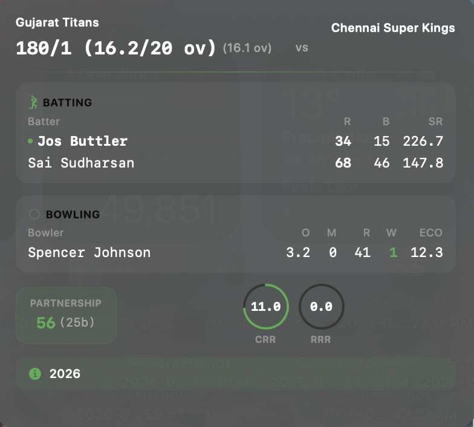

# 🏟️ NotchIslandSports

A premium, native macOS background utility that transforms your MacBook Pro screen notch into a highly fluid, responsive live sports tracking dashboard. 

Stream real-time ball-by-ball sports data and score updates natively right under your display bezel.

---

## ✨ Features

* **🏏 Live Multi-Sport Engine:** Production-grade background parsing across 8 sports (Cricket/IPL, Tennis, NFL, College Football, College Basketball, Soccer, Lacrosse, and Volleyball) powered by polling-optimized ESPN API endpoints.
* **📱 Adaptive Bezel Layouts:** Native geometry inspection. If running on a notched Apple Silicon MacBook Pro, it locks down into an ultra-compact **220pt capsule**. If running on flat-bezel MacBooks (Intel), it dynamically expands into a detailed, untruncated **340pt floating pill**.
* **🔄 Rolling Recency & Auto-Pivoting:** Smart layout hierarchy prioritizes live matches automatically. If no active live frames are running, the app gracefully cycles the last 24 hours of completed games (like yesterday's KKR vs MI clash) or renders visual upcoming match countdown badges.

---

## 📦 Fast Installation (No Coding Required)
Download the NotchIslandSports.zip file from the file list above.
Extract the file and drag NotchIslandSports.app straight into your Applications folder.
First-Time Activation Bypass: Right-click (Control-click) NotchIslandSports.app and select Open from the menu. When the unverified developer security warning box appears, click Open to authorize your Mac to run the ad-hoc build.
Clear Quarantine Hold (If Blocked): If macOS treats the bundle as damaged or blocked, pop open your Terminal app and clear the Gatekeeper quarantine flag by running: xattr -cr /Applications/NotchIslandSports.app

## App Previews
Here is how the application renders on screen during live match intervals:

### 1. Collapsed Untruncated View (Intel / Flat Bezel Screens)

### 2. Collapsed Untruncated View (Apple Silicon / With notch)

### 3. Expanded Scorecard Dropdown Panel

## 📄 License & Copyright

This project is licensed under the terms of the MIT License.

Copyright © 2026 Sahil Pardasani. All rights reserved. 

Contributions, bug fixes, and feature requests for new sports divisions are welcome!

